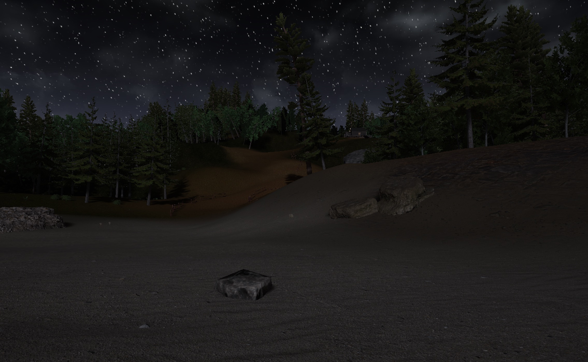

# Patch
This is a continuous assessment project created as part of my MSc in Computing in Video Games and Extended Reality. It was my first step into Unreal Engine and I'm pretty happy with it in its current state given the time constraints and the time of year.

I took heavy inspiration from Lovecraft's Call of Cthulhu for the vibe and interactions within. Given more time I would like to flesh out the overall flow and add more steps and storytelling. The layout of the landscape and level is something I am happy with as can be seen from the player start point there is nice framing and highlighting of where they are to go to get started and then to guide the player from the cabin using lights to the final interaction.

 

 Using Blueprints for the first time it proved challenging at the start as I wasn't sure what I was looking for or why things didn't work at times. I found myself wishing I was writing code so that I would at least see exactly what was not working and how to fix it. As I got more experience and started actually learning the component types, what they can connect to and also just reading the tooltips I got more comfortable and by the end was throwing a lot more together without reference.

The overall gloomy and oppressive tone with the lighting, scene and fog is something I am very happy with and would like to return to.

### References

- [Guide used for creating Highlight Material](https://www.youtube.com/watch?v=rGqlReFObYQ)
- [Guide used to learn about interface interactions for door and book](https://www.youtube.com/watch?v=u4TBbtq9uwk&t=390s)

- [Footstep Sounds](https://pixabay.com/sound-effects/footsteps-on-gravel-61337/)
- [Rumble Sound](https://pixabay.com/sound-effects/low-rumble-167812/)
- Cabin Assets [by PolyPixel3D](http://www.polypixel3d.com/services/)
- Landscape Assets and Props sourced from [Quixel Bridge](https://quixel.com/bridge)
